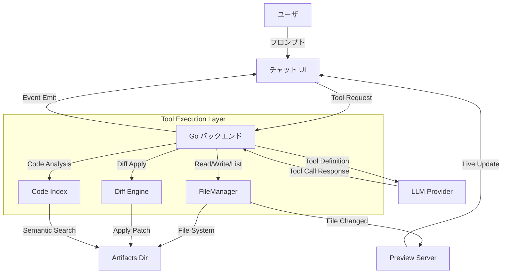
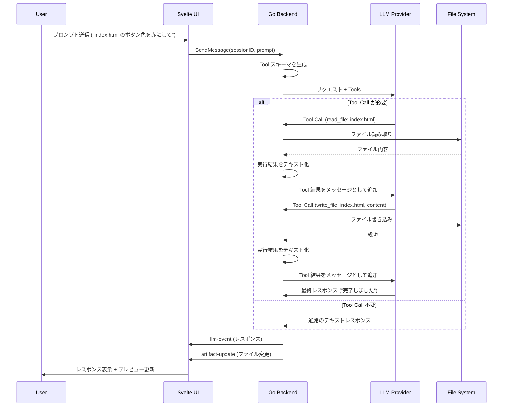

# 03. エージェント拡張設計書 (Agent Extension Specification)

## 1. 背景と目的

### 1.1. 現状の課題

現在の `fm-my-canvas` はチャットコンテキストベースの Canvas/Artifact 機能を提供している。しかし、大規模コード操作においては以下の課題が存在する。

| 課題 | 詳細 |
|------|------|
| **コンテキスト圧迫** | チャット履歴が膨らむとトークン制限に達し、初期のコード認識が不正確になる |
| **1 つ前のコード認識の不安定化** | 繰り返し編集で「直前のコード状態」がコンテキストから正確に拾えない |
| **複数ファイル操作の限界** | 依存関係のある複数ファイルのリファクタリングが困難 |
| **差分ベース編集の実現不足** | 「ここだけ直す」指示に対しても、完全なコード再生成になりがち |

### 1.2. 目的

Tool Call を活用したコードエージェント機能を追加し、以下の能力を付与する。

- **コンテキスト独立のファイル操作**: チャット履歴に依存せず、直接ファイルシステムからコードを取得・編集
- **差分ベース編集**: `git diff` 形式での最小変更提示と適用
- **複数ファイルの同時操作**: プロジェクト全体の理解と、依存関係のある複数ファイルの協調編集
- **大規模リファクタリング対応**: 長期的な開発セッションでの状態維持

---

## 2. アーキテクチャ設計

### 2.1. 全体アーキテクチャ



### 2.2. 従来のコンテキストベースとの違い

| 項目 | 従来 (コンテキストベース) | 拡張後 (Tool Call ベース) |
|------|--------------------------|------------------------|
| **コードソース** | チャット履歴内の Markdown | ファイルシステム直接アクセス |
| **状態管理** | チャットメッセージに蓄積 | ファイルシステム + セッションメタデータ |
| **編集単位** | 完全なコード再生成 | 差分パッチ適用 |
| **複数ファイル** | 1 回の変更に複数ファイル可能 | 複数ファイルの同時編集・リファクタリング |
| **トークン効率** | 履歴が長くても全コードをコンテキストに含める | 必要なファイルのみロード、差分のみ送信 |
| **リファクタリング** | 会話コンテキストで依存関係を追跡 | ファイルシステム構造から依存関係を検出 |

---

## 3. Tool Call デザイン

### 3.1. Tool スキーマ定義

OpenAI 互換の Tool Call 形式を採用する。各 Tool は以下のメタデータを有する。

```typescript
interface Tool {
  type: "function";
  function: {
    name: string;
    description: string;
    parameters: {
      type: "object";
      properties: Record<string, any>;
      required: string[];
    };
  };
}
```

### 3.2. 内部型の拡張

Tool Call をサポートするため、既存の `types/types.go` を以下のように拡張する必要がある。

```go
type Role string

const (
    RoleUser      Role = "user"
    RoleAssistant Role = "assistant"
    RoleSystem    Role = "system"
    RoleTool      Role = "tool"       // 追加: Tool 実行結果のロール
)

type ToolCall struct {
    ID        string `json:"id"`         // OpenAI 互換 (Ollama は空文字の場合あり)
    Name      string `json:"name"`       // 呼び出す Tool 名
    Arguments string `json:"arguments"`  // JSON 文字列
}

type Message struct {
    Role      Role       `json:"role"`
    Content   string     `json:"content"`
    ToolCalls []ToolCall `json:"tool_calls,omitempty"` // 追加: assistant メッセージ内の Tool Call
    ToolCallID string   `json:"tool_call_id,omitempty"` // 追加: tool ロール時の紐付け ID
    CreatedAt string     `json:"created_at"`
}
```

**後方互換性**: `tool_calls`, `tool_call_id` は `omitempty` により、既存セッション JSON の読み込みに影響しない。

---

### 3.3. 実装する Tools

#### 3.3.1. `read_file` - ファイル読み取り

**目的**: 既存の Artifact ファイルの内容を取得し、コンテキストに含める。

```json
{
  "name": "read_file",
  "description": "Read the contents of a file from the current artifact workspace.",
  "parameters": {
    "type": "object",
    "properties": {
      "path": {
        "type": "string",
        "description": "The relative path of the file to read (e.g., 'index.html', 'components/Button.vue')."
      }
    },
    "required": ["path"]
  }
}
```

**実装イメージ**:
```go
type ReadFileTool struct {
    manager *artifacts.Manager
}

func (t *ReadFileTool) Execute(sessionID string, args map[string]any) (string, error) {
    path := args["path"].(string)
    dir := t.manager.WorkspaceDir(sessionID)
    fullPath := filepath.Join(dir, path)
    
    content, err := os.ReadFile(fullPath)
    if err != nil {
        return "", fmt.Errorf("file not found: %s", path)
    }
    
    return string(content), nil
}
```

---

#### 3.3.2. `write_file` - ファイル書き込み

**目的**: 修正後のコードをファイルに書き込む。

```json
{
  "name": "write_file",
  "description": "Write content to a file in the artifact workspace. Creates the file if it doesn't exist.",
  "parameters": {
    "type": "object",
    "properties": {
      "path": {
        "type": "string",
        "description": "The relative path of the file to write."
      },
      "content": {
        "type": "string",
        "description": "The full content to write to the file."
      }
    },
    "required": ["path", "content"]
  }
}
```

**実装イメージ**:
```go
type WriteFileTool struct {
    manager *artifacts.Manager
}

func (t *WriteFileTool) Execute(sessionID string, args map[string]any) (string, error) {
    path := args["path"].(string)
    content := args["content"].(string)
    
    if err := t.manager.WriteFile(sessionID, path, content); err != nil {
        return "", err
    }
    
    return fmt.Sprintf("Successfully wrote to %s", path), nil
}
```

---

#### 3.3.3. `list_files` - ファイル一覧取得

**目的**: 現在のワークスペースのファイル構造を把握する。

```json
{
  "name": "list_files",
  "description": "List all files in the artifact workspace or a specific directory.",
  "parameters": {
    "type": "object",
    "properties": {
      "path": {
        "type": "string",
        "description": "The relative path of the directory to list. Empty for workspace root."
      }
    },
    "required": []
  }
}
```

**実装イメージ**:
```go
type ListFilesTool struct {
    manager *artifacts.Manager
}

func (t *ListFilesTool) Execute(sessionID string, args map[string]any) (string, error) {
    path := ""
    if p, ok := args["path"]; ok {
        path = p.(string)
    }
    
    dir := t.manager.WorkspaceDir(sessionID)
    if path != "" {
        dir = filepath.Join(dir, path)
    }
    
    files, err := t.manager.ListFiles(sessionID)
    if err != nil {
        return "", err
    }
    
    // Filter and format as tree
    return formatFileTree(files, path), nil
}
```

---

#### 3.3.4. `apply_edit` - Search/Replace 編集 (Phase 2)

**目的**: 既存コードへの最小変更を search/replace 方式で適用する。LLM の出力精度が高く、適用が確実。

```json
{
  "name": "apply_edit",
  "description": "Apply a search/replace edit to an existing file. Finds the exact search text and replaces it.",
  "parameters": {
    "type": "object",
    "properties": {
      "path": {
        "type": "string",
        "description": "The relative path of the file to edit."
      },
      "search": {
        "type": "string",
        "description": "The exact text to find in the file."
      },
      "replace": {
        "type": "string",
        "description": "The text to replace the search text with."
      }
    },
    "required": ["path", "search", "replace"]
  }
}
```

**実装イメージ**:
```go
type ApplyEditTool struct {
    manager *artifacts.Manager
}

func (t *ApplyEditTool) Execute(sessionID string, args map[string]any) (string, error) {
    path := args["path"].(string)
    search := args["search"].(string)
    replace := args["replace"].(string)

    content, err := t.manager.ReadFile(sessionID, path)
    if err != nil {
        return "", err
    }

    if strings.Count(content, search) != 1 {
        return "", fmt.Errorf("search text not found or matches multiple locations in %s", path)
    }

    updated := strings.Replace(content, search, replace, 1)
    if err := t.manager.WriteFile(sessionID, path, updated); err != nil {
        return "", err
    }

    return fmt.Sprintf("Successfully edited %s", path), nil
}
```

> **方式選定の背景**: LLM が生成する unified diff はフォーマット不正が多く、Cursor / Aider 等の商用ツールでも search/replace ブロック方式に移行している。`apply_edit` を主要な差分編集 Tool とし、`apply_diff` はオプションとして併設する。いずれの方式も適用失敗時は `write_file` による完全再生成にフォールバックする。

---

#### 3.3.5. `apply_diff` - 差分パッチ適用 (Phase 2, ~~オプション~~ → 延期)

> **状態**: 実装見送り。LLM が利用可能なツール数が増えると混乱しやすいため、`apply_edit` + `write_file` の 2 本に絞る方針に変更した。将来的に必要になれば追加を検討する。

**目的**: ~~既存コードへの差分パッチを適用し、最小変更でコードを更新。~~ → 延期

```json
{
  "name": "apply_diff",
  "description": "Apply a unified diff patch to an existing file. The diff should be in standard unified diff format.",
  "parameters": {
    "type": "object",
    "properties": {
      "path": {
        "type": "string",
        "description": "The relative path of the file to patch."
      },
      "diff": {
        "type": "string",
        "description": "The unified diff patch to apply. Format:\n--- path/to/file\n+++ path/to/file\n@@ -1,5 +1,6 @@\n line before\n-line removed\n+line added\n line after"
      }
    },
    "required": ["path", "diff"]
  }
}
```

---

#### 3.3.6. `search_code` - コード検索（Phase 3, オプション）

**目的**: プロジェクト全体から特定のコードを検索し、関連ファイルを見つけ出す。

```json
{
  "name": "search_code",
  "description": "Search for a pattern in all files in the artifact workspace. Returns matching files and line numbers.",
  "parameters": {
    "type": "object",
    "properties": {
      "pattern": {
        "type": "string",
        "description": "The regex pattern to search for."
      },
      "file_pattern": {
        "type": "string",
        "description": "Optional file pattern to filter (e.g., '*.ts', '*.go')."
      }
    },
    "required": ["pattern"]
  }
}
```

---

### 3.4. Tool 呼び出しフロー



---

## 4. 実装計画

### 4.1. フェーズ 1: 基本 Tool 実装

**目標**: `read_file`, `write_file`, `list_files` の実装と基本フローの確立

#### 4.1.1. バックエンド (Go)

1. **Tool インターフェースの定義** (`tools/tool.go`):
   ```go
   type Tool interface {
       Name() string
       Description() string
       Parameters() map[string]any
       Execute(sessionID string, args map[string]any) (string, error)
   }
   ```

   2. **Tool レジストリ** (`tools/registry.go`):
    ```go
    type ToolManager struct {
        registry map[string]Tool
    }
    
    func (m *ToolManager) Register(tool Tool)
    func (m *ToolManager) Tools() []Tool
    func (m *ToolManager) Execute(sessionID string, tc types.ToolCall) (string, error)
    func (m *ToolManager) ExecuteWithContext(ctx context.Context, sessionID string, tc types.ToolCall) (string, error)
    ```
    
    **注意**: `Tools()` は内部で map をイテレートするため返却順が非決定的。現状は許容しているが、将来的に安定化が必要な場合は sorted keys を使用する。

3. **各 Tool の実装** (`tools/file_*_tool.go`):
   - `ReadFileTool`
   - `WriteFileTool`
   - `ListFilesTool`

4. **Provider インターフェースの拡張** (`provider/provider.go`):

   **設計方針**: Provider はストリームの解析のみを担い、Tool Call の実行ループは ChatService が管理する。`handleToolCall` を Provider に渡す設計は責務の混入を招くため避ける。

   ```go
   type StreamEventType string

   const (
       EventContent  StreamEventType = "content"   // テキストチャンク
       EventToolCall StreamEventType = "tool_call"  // Tool Call 要求
       EventDone     StreamEventType = "done"       // ストリーム終了
   )

   type StreamEvent struct {
       Type      StreamEventType
       Content   string           // EventContent の場合: テキスト差分
       ToolCalls []types.ToolCall // EventToolCall の場合: Tool Call リスト
   }

   type ToolDefinition struct {
       Type     string `json:"type"`     // "function"
       Function struct {
           Name        string `json:"name"`
           Description string `json:"description"`
           Parameters  any    `json:"parameters"`
       } `json:"function"`
   }

   type Provider interface {
       Stream(ctx context.Context, messages []types.Message, cb func(chunk string)) error
       StreamWithTools(ctx context.Context, messages []types.Message, tools []ToolDefinition, cb func(event StreamEvent)) error
   }
   ```

   **ChatService 側の Tool Call ループ**:
   ```go
   func (c *ChatService) sendMessageWithTools(sessionID string, messages []types.Message) error {
       // ... 省略: プロバイダ選択 ...

       for round := 0; round < maxToolRounds; round++ {
           var textAccumulated string
           var toolCalls []types.ToolCall

           err := p.StreamWithTools(ctx, allMessages, toolDefs, func(event provider.StreamEvent) {
               switch event.Type {
               case provider.EventContent:
                   textAccumulated += event.Content
                   // フロントエンドに chunk を emit
               case provider.EventToolCall:
                   toolCalls = append(toolCalls, event.ToolCalls...)
               case provider.EventDone:
                   // 何もしない
               }
           })

           if len(toolCalls) == 0 {
               // Tool Call なし → 最終レスポンス
               break
           }

           // Tool Call あり → 実行して結果をメッセージに追加
           allMessages = append(allMessages, types.Message{
               Role:      types.RoleAssistant,
               Content:   textAccumulated,
               ToolCalls: toolCalls,
           })
           for _, tc := range toolCalls {
               result, err := toolManager.Execute(sessionID, tc)
               if err != nil {
                   result = fmt.Sprintf("Error executing %s: %s", tc.Name, err.Error())
               }
               allMessages = append(allMessages, types.Message{
                   Role:       types.RoleTool,
                   Content:    result,
                   ToolCallID: tc.ID,
               })
               // Tool 実行状態をフロントエンドに通知
               wailsRuntime.EventsEmit(ctx, "tool-event", map[string]any{
                   "type":       "tool_result",
                   "tool_name":  tc.Name,
                   "success":    err == nil,
                   "session_id": sessionID,
               })
           }
       }
       // ... 省略: アシスタントメッセージ保存, artifact-update emit ...
   }
   ```

   5. **ChatService の拡張** (`chat.go`):

    既存の `SendMessage` 内部で `AgentMode` を判定し分岐する。Wails バインディングに変更なし。

    ```go
    func (c *ChatService) SendMessage(sessionID string, message string) error {
        // ... ユーザメッセージ保存, System Prompt 構築 ...
        if c.config.AgentMode {
            return c.sendMessageWithTools(sessionID, allMessages)
        }
        return c.sendMessageMarkdown(sessionID, allMessages)
    }
    ```

    **追加の Wails バインディング**:
    - `CancelSend()` — Tool Call ループ / LLM ストリームのユーザーキャンセル
    - `GetArtifactFileContents(sessionID)` — セッション内全ファイルの内容を `[]ArtifactFileInfo` で返す（Code タブのディスク表示用）

6. **Provider 実装ごとの Tool Call フォーマット差異**:

   各 Provider の `StreamWithTools` はレスポンス形式が異なるため、それぞれ正規化して `StreamEvent` として返す必要がある。

   | 項目 | Ollama (`/api/chat`) | OpenRouter (OpenAI 互換) |
   |------|---------------------|--------------------------|
   | **Tool Call 検出** | `message.tool_calls` 配列 | `choices[0].delta.tool_calls` 配列 |
   | **Arguments 形式** | `map[string]any` (JSON object) | `string` (JSON 文字列のストリーミング delta) |
   | **Tool Call ID** | 空文字の場合あり | `call_` プレフィクス付き ID |
   | **ストリーミング** | Tool Call は一度に全件送信 | `index` ごとに delta で順次送信 → 完結後に `finish_reason: "tool_calls"` |
   | **正規化** | `arguments` を `json.Marshal` で文字列化 | delta を蓄積して最終的な JSON に結合 |

   **Ollama レスポンス例**:
   ```json
   {"message":{"role":"assistant","content":"","tool_calls":[{"function":{"name":"read_file","arguments":{"path":"index.html"}}}]},"done":false}
   ```

   **OpenRouter レスポンス例 (ストリーミング)**:
   ```json
   {"choices":[{"delta":{"tool_calls":[{"index":0,"id":"call_abc","function":{"name":"read_file","arguments":"{\"pa"}}]},"finish_reason":null}]}
   {"choices":[{"delta":{"tool_calls":[{"index":0,"function":{"arguments":"th\": \"index.html\"}"}}]},"finish_reason":null}]}
   {"choices":[{"delta":{},"finish_reason":"tool_calls"}]}
   ```

7. **artifacts.Manager の拡張** (`artifacts/manager.go`):

   現在の Manager にはファイル読み取りメソッドが存在しないため、`read_file` Tool のために追加が必要。加えて、**セキュリティ要件は Read だけでなく Write/List を含む全ファイル操作に共通適用**する。

   ```go
   func (m *Manager) validateWorkspacePath(sessionID, filename string) (string, error) {
       dir := m.WorkspaceDir(sessionID)
       fullPath := filepath.Join(dir, filename)
       cleanDir := filepath.Clean(dir)
       cleanPath := filepath.Clean(fullPath)
       if !strings.HasPrefix(cleanPath, cleanDir+string(os.PathSeparator)) {
           return "", fmt.Errorf("path traversal detected: %s", filename)
       }
       return cleanPath, nil
   }

   func (m *Manager) ReadFile(sessionID, filename string) (string, error) {
       fullPath, err := m.validateWorkspacePath(sessionID, filename)
       if err != nil {
           return "", err
       }
       info, err := os.Stat(fullPath)
       if err != nil {
           return "", fmt.Errorf("file not found: %s", filename)
       }
       if info.Size() > 1*1024*1024 {
           return "", fmt.Errorf("file too large: %s", filename)
       }
       content, err := os.ReadFile(fullPath)
       if err != nil {
           return "", fmt.Errorf("failed to read file: %s: %w", filename, err)
       }
       return string(content), nil
   }

   func (m *Manager) WriteFile(sessionID, filename, content string) error {
       fullPath, err := m.validateWorkspacePath(sessionID, filename)
       if err != nil {
           return err
       }
       if len(content) > 1*1024*1024 {
           return fmt.Errorf("content too large: %s", filename)
       }
       // tmp write + rename (既存処理)
       return atomicWrite(fullPath, content)
   }

   func (m *Manager) ListFiles(sessionID string) ([]string, error) {
       // 内部で validateWorkspacePath と同等の prefix 検証を行い、
       // workspace 外のシンボリックリンク経由参照を拒否する
   }
   ```

#### 4.1.2. フロントエンド (Svelte)

1. **Tool Call 可視化** (`components/chat/ToolCallMessage.svelte`):
   - Tool 呼び出しをチャットログに展開可能で表示
   - 実行結果を折りたたみ表示
   - 実行中 / 成功 / 失敗のステータスアイコン表示

2. **設定 UI** (`components/layout/SettingsModal.svelte`):
   - "Agent モード" の切替スイッチ追加
   - ヒント文: "Uses Tool Calls for file operations instead of Markdown code blocks."

3. **動作中インジケーター + 停止ボタン** (`components/chat/ChatInput.svelte`):
   - ストリーミング中: 緑色のパイロットランプ（パルスアニメーション）+ "Working..." ラベル + Stop ボタン
   - 待機中: Send ボタン

4. **Console Capture** (`components/artifacts/ConsolePane.svelte`, `lib/services/wails.ts`):
   - アプリ自身の `console.log/error/warn/info` をグローバル傍受
   - iframe からの `postMessage` (`type: 'iframe-console'`) をリッスン
   - Console タブでログのフィルタ (All/Log/Error/Warn/Info) とクリア機能

5. **Event Handler の拡張** (`lib/services/wails.ts`):
   - `llm-event` は既存の `chunk` / `done` / `error` のみ処理
   - `tool-event` で `tool_call` / `tool_result` を処理
   - `artifact-update` で `loadArtifactFilesFromDisk` を呼び出し、ディスク上のファイル内容を取得
   - `cancelSend()` でユーザーキャンセルを発火

   **イベントプロトコル**:

   | イベント | payload | 備考 |
   |---------|---------|------|
   | `llm-event` | `{type, content, session_id} map[string]string` | `chunk`, `done`, `error` のみ。既存互換を維持 |
   | `tool-event` | `{type:"tool_call", tool_name, tool_args, session_id} map[string]any` | Tool 開始通知 |
   | `tool-event` | `{type:"tool_result", tool_name, result, success, session_id} map[string]any` | Tool 終了通知 |
   | `artifact-update` | `{session_id, preview_url, files} map[string]string` | 既存形式を維持 |

### 4.1.3. MVP スコープの固定（フェーズ 1 の境界）

**フェーズ 1 で実装する範囲（In Scope）**:
- `read_file`, `write_file`, `list_files`
- Provider の `StreamWithTools`（Ollama / OpenRouter）
- ChatService のモード分岐 + Tool Call ループ
- 設定 UI の Agent モード切替
- Tool 実行の最小可視化（`tool-event`）

**フェーズ 1 では実装しない範囲（Out of Scope）**:
- `apply_edit` / `apply_diff` と Edit/Diff Engine
- `search_code` とコードインデックス
- 並列 Tool 呼び出し、マルチエージェント

この境界を固定し、MVP は「既存 Markdown モードを壊さず Tool Call ベース編集を追加する」ことを受け入れ条件とする。

---

### 4.2. 既存フローとの共存戦略

Tool Call ベースの Agent モードは、既存のマークダウンベースの Artifact フローと**並列して動作**する。

#### 4.2.1. モード切替

`config.Config` に `AgentMode` フィールドを追加し、ユーザがモードを選択可能にする。

```go
type Config struct {
    // ... 既存フィールド ...
    AgentMode bool `json:"agent_mode"` // true: Tool Call, false: 従来の Markdown
}
```

| モード | 送信フロー | Artifact 更新 | System Prompt |
|--------|-----------|--------------|---------------|
| **Markdown (既定)** | `Stream()` | レスポンス後の `parseArtifacts()` で抽出 | コードブロック出力指示 |
| **Agent** | `StreamWithTools()` | Tool 実行 (`write_file`) で直接書き込み | Tool 使用指示 |

#### 4.2.2. System Prompt の切替

```go
func buildSystemPrompt(agentMode bool) string {
    if agentMode {
        return agentModeSystemPrompt // Tool 使用指示 (セクション 5.1 参照)
    }
    return markdownModeSystemPrompt // 既存の Markdown コードブロック指示
}
```

#### 4.2.3. セッション間の互換性

- Markdown モードで作成されたセッションを Agent モードで開いても、ファイルシステム上の Artifact は引き続き参照可能
- Agent モードのセッション履歴には Tool Call メッセージが含まれるが、Markdown モードで開いた場合は Tool Call メッセージはテキストとして表示される

#### 4.2.4. RestoreArtifacts の Agent モード対応

現在の `RestoreArtifacts` は最後の assistant メッセージからコードブロックを正規表現で抽出して復元している。Agent モードではファイルは Tool Call (`write_file`) で直接書き込まれるため、Markdown パースによる復元が機能しない。

**実装**: `RestoreArtifacts` は内部で `resolveArtifactInfo` ヘルパーを呼び出し、ファイルシステムをソースオブトゥルースとして動作する。

```go
func (c *ChatService) resolveArtifactInfo(sessionID string) (files []string, previewURL string, ok bool) {
    files, err := c.artifact.ListFiles(sessionID)
    if err != nil || len(files) == 0 {
        return nil, "", false
    }

    wsDir := c.artifact.WorkspaceDir(sessionID)
    url, serr := c.server.Start(c.ctx, wsDir)
    if serr != nil {
        return nil, "", false
    }
    c.server.UpdateDir(wsDir)

    previewURL = url
    for _, f := range files {
        if f == "index.html" {
            previewURL = url + "/index.html"
            break
        }
    }
    return files, previewURL, true
}

func (c *ChatService) RestoreArtifacts(sessionID string) map[string]string {
    files, previewURL, ok := c.resolveArtifactInfo(sessionID)
    if !ok {
        return map[string]string{}
    }

    result := map[string]string{"files": strings.Join(files, ",")}
    if previewURL != "" {
        result["preview_url"] = previewURL
    }
    return result
}
```

**設計方針**: Agent モード / Markdown モードに関わらず、**ファイルシステムの実態**をソースオブトゥルースとする。Markdown パースへの依存を除去することで、モード間の互換性問題を回避する。

**補足**: `index.html` が存在しない場合、`previewURL` はサーバーのルート URL となり、`generateDirectoryListing` によりファイル一覧ページが表示される。

#### 4.2.5. Provider の Tool Call 対応能力チェック

Ollama のモデルの中には Tool Call をサポートしないものがある（例: 古い llama3, phi3）。Agent モードで非対応モデルを選択した場合のハンドリングが必要。

| シナリオ | 対応 |
|---------|------|
| **Tool Call 非対応モデル + Agent モード** | `StreamWithTools` が空の Tool Call で返る → 通常テキストとして処理 (Markdown モードと同等の動作) |
| **API エラー (400 等)** | フロントエンドに `llm-event (error)` で通知し、設定変更を促すメッセージを表示 |

```go
// StreamWithTools 内でモデル非対応を検出した場合のフォールバック例
if resp.StatusCode == http.StatusBadRequest {
    // Tool Call 非対応の可能性 → エラーとして通知
    return fmt.Errorf("model may not support tool calls: %s", resp.Status)
}
```

---

### 4.3. フェーズ 2: 差分ベース編集 — ✅ 主経路完了

**目標**: 最小変更でコードを更新する仕組みの実装

#### 4.3.1. 実装済みコンポーネント

1. **Search/Replace Engine** (`tools/edit_engine.go`) — ✅ 実装済み
   ```go
   type EditEngine struct{}
   
   // EditResult 構造体は使用せず、Apply は (string, error) を直接返す簡略化されたシグネチャ
   func (e *EditEngine) Apply(content, search, replace string) (string, error)
   func (e *EditEngine) FindMatchCount(content, search string) int
   // エラー判定ヘルパー:
   func IsNoMatch(err error) bool
   func IsMultipleMatches(err error) bool
   func IsEmptySearch(err error) bool
   func IsFileSizeLimit(err error) bool
   ```

2. ~~**Diff Engine (オプション)** (`tools/diff_engine.go`)~~ — 延期
   - ツール数増加による LLM 混乱を避けるため `apply_edit` + `write_file` のみ提供

3. **LLM プロンプトの最適化** — ✅ 実装済み
   - System prompt に search/replace フォーマットの使用指示を追加
   - 小さな変更は `apply_edit`、大きな変更やファイル全体の書き換えは `write_file` を使い分ける指示

4. **フォールバック戦略** — ✅ 実装済み
   - `apply_edit` 適用失敗時、エラーを LLM にフィードバック
   - System Prompt で `write_file` での完全再生成を誘導

5. **Context Window 管理** — ✅ 実装済み
   - `summarizeOldToolResults` により、直近 2 ラウンドの Tool 結果は保持、古いものは 1 行目 (max 100 chars) の要約に置換

---

### 4.4. フェーズ 3: 高度な機能

**目標**: `search_code` とプロジェクト全体の理解

1. **コードインデックス** (`tools/code_index.go`):
   - ファイル構造のツリー構築
   - 記号テーブルの構築（関数名、変数名など）
   - 依存関係の解析

2. **セマンティック検索**（オプション）:
   - ベクトルデータベースの導入（ローカル：ChromaDB, Weaviate）
   - コードスニペットの埋め込み

3. **自動リファクタリング**:
   - 複数ファイルの同時編集計画立案
   - 変更の衝突検出と解決

---

## 5. プロンプト設計

### 5.1. System Prompt の拡張

System Prompt は**実装済みの Tool のみを列挙**する。フェーズが進むにつれて Tool リストを拡張する。

**Phase 1 版**:
```
You are a helpful coding assistant with file system access. You can read, write, and list files in the user's artifact workspace.

When asked to modify code:
1. First, use read_file to understand the current code
2. Analyze what needs to be changed
3. Use write_file to write the updated code
4. Always verify your changes make sense in the context of the whole project

When asked about the project structure:
1. Use list_files to understand the file layout
2. Read relevant files to understand dependencies

Available tools:
- read_file(path): Read file contents
- write_file(path, content): Write file contents
- list_files([path]): List files in directory
```

**Phase 2 で追加**:
```
For minimal changes to existing code, use apply_edit instead of rewriting the whole file.

Additional tools:
- apply_edit(path, search, replace): Apply a search/replace edit to a file
```

**Phase 3 で追加**:
```
For large refactoring tasks:
1. Use search_code to find related code across the project
2. Plan your changes across multiple files
3. Execute changes one file at a time

Additional tools:
- search_code(pattern, [file_pattern]): Search code in all files
```

### 5.2. Tool 使用のガイドライン

**`apply_edit` (search/replace) 推奨ケース** (Phase 2以降):
- 既存コードのバグ修正
- 小さな機能追加
- スタイル変更

**`write_file` (完全再生成) 推奨ケース**:
- ファイル全体の再設計
- 構造的な変更
- 新規ファイルの作成

---

## 6. プロジェクト構成の更新

```text
fm-my-canvas/
├── main.go
├── app.go
├── chat.go                  # sendMessageWithTools, CancelSend, GetArtifactFileContents,
                              # resolveArtifactInfo, newProvider, summarizeOldToolResults,
                              # buildToolDefinitions, languageFromExt, モード分岐
├── chat_test.go
├── provider/
│   ├── provider.go          # StreamEvent, ToolDefinition 型, StreamWithTools 追加
│   ├── ollama.go            # StreamWithTools 実装 (NDJSON tool_calls 解析)
│   ├── ollama_test.go
│   ├── openrouter.go        # StreamWithTools 実装 (SSE delta.tool_calls 解析)
│   └── openrouter_test.go
├── artifacts/
│   ├── manager.go           # ReadFile, WriteFile, ListFiles, validateWorkspacePath,
│   │                        # NewManagerWithDir, symlink 解決
│   ├── manager_test.go
│   └── server.go            # console interceptor 注入, ディレクトリリスト自動生成,
│                            # cachedFileServer, キャッシュ制御ヘッダ
├── tools/
│   ├── tool.go              # Tool インターフェース
│   ├── registry.go          # Tool 登録・実行ディスパッチ, ExecuteWithContext (30s timeout)
│   ├── registry_test.go
│   ├── file_read_tool.go
│   ├── file_read_tool_test.go
│   ├── file_write_tool.go
│   ├── file_write_tool_test.go
│   ├── file_list_tool.go
│   ├── file_list_tool_test.go
│   ├── edit_engine.go       # EditEngine: search/replace 適用ロジック
│   ├── edit_engine_test.go
│   ├── edit_apply_tool.go   # apply_edit Tool
│   └── edit_apply_tool_test.go
├── session/
│   └── manager.go           # 自動タイトル設定, strings.TrimSuffix 使用
├── config/
│   └── config.go            # AgentMode フィールド追加
├── types/
│   ├── types.go             # ToolCall, RoleTool, ArtifactFileInfo 追加
│   └── types_test.go
├── frontend/
│   └── src/
│       ├── lib/
│       │   ├── services/
│       │   │   └── wails.ts          # tool_call/tool_result リスナー, console キャプチャ,
│       │   │                         # loadArtifactFilesFromDisk, cancelSend, scheduleArtifactUpdate
│       │   ├── stores/
│       │   │   └── chat.svelte.ts    # toolCallLog, consoleLogs state 追加
│       │   └── parsers/
│       │       └── artifact.ts
│       └── components/
│           ├── chat/
│           │   ├── ChatArea.svelte         # tool ロール除外, ToolCallMessage 表示, cancelSend
│           │   ├── ChatInput.svelte        # パイロットランプ, Stop ボタン, 自動リサイズ
│           │   ├── ChatMessage.svelte
│           │   └── ToolCallMessage.svelte  # Tool Call ログ可視化
│           ├── artifacts/
│           │   └── ConsolePane.svelte      # Console ログ表示, フィルタ, iframe 送信元タグ
│           └── layout/
│               └── SettingsModal.svelte    # Agent モード切替追加
└── docs/
    ├── 01_requirement.md
    ├── 02_specification.md
    ├── 03_agent_update.md       # 本ドキュメント
    ├── 04_agent_specification.md # Phase 1 実装仕様書
    └── 05_agent_specification_2.md # Phase 2 実装仕様書
```

### 実装により追加された設計外コンポーネント

以下は本設計書で規定されていなかったが、実装過程で追加されたコンポーネントである。

| コンポーネント | 場所 | 概要 |
|---------------|------|------|
| **Console Capture** | `server.go`, `wails.ts`, `ConsolePane.svelte` | iframe / アプリの console 出力を傍受し、Console タブに表示する仕組み |
| **CancelSend** | `chat.go` | ユーザーによる Tool Call ループ / LLM ストリームのキャンセル機能（`context.Cancel` ベース） |
| **GetArtifactFileContents** | `chat.go` | セッション内全ファイルの内容を `ArtifactFileInfo` で返す。Code タブのディスク表示用 |
| **ArtifactFileInfo** | `types/types.go` | Path / Language / Content を持つ型。フロントエンドの artifact panel 用 |
| **languageFromExt** | `chat.go` | 拡張子 → 言語 ID マッピングヘルパー |
| **resolveArtifactInfo** | `chat.go` | `RestoreArtifacts` / `emitArtifactUpdate` 共通の artifact 解決ヘルパー。index.html がない場合はディレクトリリストページ URL を返す |
| **generateDirectoryListing** | `server.go` | `index.html` 不在時、ダークテーマのファイル一覧 HTML を自動生成 |
| **cachedFileServer** | `server.go` | `no-cache` ヘッダ + HTML への console interceptor 注入 + ディレクトリリストフォールバック |
| **自動タイトル設定** | `session/manager.go` | "New Chat" セッションのタイトルを最初のユーザーメッセージ（先頭 50 文字）に自動設定 |
| **symlink 解決** | `artifacts/manager.go` | `ListFiles` で `filepath.EvalSymlinks` を使用し、workspace 外へのシンボリックリンク経由参照を拒否 |

---

## 7. テスト戦略

Tool Call 実装は本プロジェクトで初の試みであり、各レイヤーを段階的にテストして検証する。

### 7.1. テスト方針

| レイヤー | テスト対象 | テスト手法 |
|---------|-----------|-----------|
| **types** | メッセージの JSON シリアライズ/デシリアライズ | `encoding/json` での往復テスト |
| **artifacts** | ReadFile, WriteFile, パスバリデーション | 一時ディレクトリを使ったユニットテスト |
| **tools** | 各 Tool の Execute | モック Manager または一時ディレクトリ |
| **provider** | StreamWithTools のレスポンス解析 | `httptest.Server` でモック LLM API |
| **ChatService** | Tool Call ループ全体 | モック Provider + モック ToolManager の統合テスト |

### 7.2. テストファイル構成

```text
types/
├── types.go
└── types_test.go              # JSON 往復テスト, RoleTool の marshal/unmarshal

artifacts/
├── manager.go
└── manager_test.go            # ReadFile, WriteFile, パストラバーサル拒否

tools/
├── tool.go
├── registry.go
├── registry_test.go           # ToolManager のディスパッチ
├── file_read_tool.go
├── file_read_tool_test.go     # read_file 成功/失敗
├── file_write_tool.go
├── file_write_tool_test.go    # write_file 成功/失敗
├── file_list_tool.go
└── file_list_tool_test.go     # list_files 空/ファイルあり

provider/
├── provider.go
├── ollama.go
├── ollama_test.go             # httptest で Tool Call ストリームをシミュレート
├── openrouter.go
└── openrouter_test.go         # httptest で delta.tool_calls ストリームをシミュレート
```

### 7.3. テスト実行コマンド

```powershell
# mise task を定義
# mise.toml に追加:
# test = { run = "go test ./...", description = "Run all Go tests" }
# "test:verbose" = { run = "go test -v ./...", description = "Run all Go tests with verbose output" }

# 全テスト実行
mise run test

# 詳細出力
mise run test:verbose

# 特定パッケージのみ
mise exec -- go test -v ./tools/...
mise exec -- go test -v ./provider/...
```

### 7.4. 実装・テストの進行順序

各ステップで **実装 → テスト → 確認** を繰り返す。LLM は実際に起動せず、モックサーバで再現する。

#### ステップ 1: types 拡張
```
実装: types.ToolCall, RoleTool, Message フィールド追加
テスト: types_test.go
確認項目:
  - RoleTool が "tool" にシリアライズされる
  - ToolCalls 付き Message の marshal/unmarshal が正しい
  - 既存セッション JSON (ToolCalls なし) がエラーなく unmarshal される (後方互換)
  - ToolCallID 付き Message が正しく marshal される
```

#### ステップ 2: artifacts.Manager.ReadFile
```
実装: ReadFile メソッド + パスバリデーション
テスト: artifacts/manager_test.go
確認項目:
  - 存在するファイルの読み取りが成功
  - 存在しないファイルでエラー
  - "../" を含むパスでエラー (パストラバーサル防止)
  - サブディレクトリ内のファイル読み取りが成功
```

#### ステップ 3: Tool インターフェース + 基本Tool
```
実装: Tool インターフェース, ToolManager, ReadFileTool, WriteFileTool, ListFilesTool
テスト: tools/manager_test.go, tools/file_*_tool_test.go
確認項目:
  - ToolManager が Tool 名で正しくディスパッチする
  - read_file: ファイル内容を返す, 存在しないファイルでエラー
  - write_file: ファイル作成, 既存ファイル上書き
  - list_files: 空ディレクトリで空配列, ファイルありで一覧返却
```

#### ステップ 4: Provider の StreamWithTools (Ollama)
```
実装: OllamaProvider.StreamWithTools
テスト: provider/ollama_test.go (httptest.Server 使用)
確認項目:
  - テキストのみのストリーム → EventContent のみ発生
  - Tool Call を含むストリーム → EventToolCall が正しく発火
  - テキスト + Tool Call 混在 → 両方のイベントが順に発生
  - Tool Call の arguments (map) が JSON 文字列に正規化される
  - Tool Call ID が空の場合でも動作する
```

#### ステップ 5: Provider の StreamWithTools (OpenRouter)
```
実装: OpenRouterProvider.StreamWithTools
テスト: provider/openrouter_test.go (httptest.Server 使用)
確認項目:
  - delta.tool_calls のストリーミング蓄積が正しい
  - finish_reason: "tool_calls" で EventToolCall が発火
  - テキストチャンクと Tool Call の混在ストリーム
  - 複数 Tool Call (index: 0, 1) の正しい結合
  - data: [DONE] で EventDone が発火
```

#### ステップ 6: ChatService の Tool Call ループ
```
実装: ChatService.sendMessageWithTools (モード分岐 + Tool Call ループ)
テスト: chat_test.go (モック Provider + モック ToolManager)
確認項目:
  - Tool Call なし → 1 ラウンドで終了, 通常メッセージ保存
  - Tool Call 1回 → read_file → write_file → 最終レスポンスの 3 ラウンド
  - maxToolRounds 到達 → 打ち切り
  - Tool 実行エラー → エラーメッセージが LLM にフィードバックされる
  - llm-event の type が正しく emit される
  - artifact-update が Tool 実行後に emit される
```

### 7.5. モックの設計

#### モック LLM API サーバ (Provider テスト用)

```go
func setupMockOllamaServer(t *testing.T, responses []string) *httptest.Server {
    t.Helper()
    return httptest.NewServer(http.HandlerFunc(func(w http.ResponseWriter, r *http.Request) {
        w.Header().Set("Content-Type", "application/json")
        for _, resp := range responses {
            fmt.Fprintf(w, "%s\n", resp)
        }
        w.(http.Flusher).Flush()
    }))
}
```

#### モック Provider (ChatService テスト用)

```go
type mockProvider struct {
    rounds [][]provider.StreamEvent // 各ラウンドで発生するイベント
    callCount int
}

func (m *mockProvider) StreamWithTools(ctx context.Context, msgs []types.Message, tools []provider.ToolDefinition, cb func(provider.StreamEvent)) error {
    events := m.rounds[m.callCount]
    m.callCount++
    for _, e := range events {
        cb(e)
    }
    return nil
}
```

---

## 8. 安全性と制限

### 8.1. セキュリティ

1. **ファイルパスのバリデーション**:
   - 相対パスのみ許可
   - `../` で親ディレクトリへのアクセスを禁止
   - ワークスペースディレクトリからの脱出防止
   - **`read_file` / `write_file` / `list_files` / `apply_edit` / `apply_diff` すべてで共通適用**

2. **ファイルサイズの制限**:
   - 読み取り: 最大 1MB
   - 書き込み: 最大 1MB
   - 差分適用後ファイル: 最大 1MB

3. **ファイルタイプの制限**（デフォルト無効、オプション有効化可能）:
   - ワークスペースはセッション単位でサンドボックス化されているため、ファイル書き込み自体は安全
   - ファイルタイプ制限はパス脱出防止の補助的手段であり、デフォルトでは全ファイルタイプを許可する
   - ユーザーが明示的に有効化した場合のみ、許可リスト (`.html`, `.css`, `.js`, `.ts` 等) で制限する

4. **Write 系操作の追加制約**:
   - `WriteFile` は検証済みパスのみ書き込み可能
   - 一時ファイルへの atomic write（tmp + rename）を維持
   - 上書き・新規作成ともに同一バリデーションを適用

### 8.2. 制限

1. **Tool 呼び出し回数制限**: 1 回のメッセージあたり最大 10 回
2. **並列 Tool 呼び出し**: 現在は sequential（順次）のみ対応
3. **エラー回復**: Tool 実行失敗時はエラー内容を LLM にフィードバックし、LLM が自律的にリカバリを試みる。Tool Call ラウンド上限 (10回) に到達した場合は打ち切り

### 8.3. キャンセルとタイムアウト

1. **ユーザーキャンセル**: Tool Call ループ中にユーザーがキャンセルした場合、`CancelSend()` が `cancelFn()` を呼び出し、`context.Cancel()` により現在の Tool 実行および LLM リクエストを中断する。`cancelMu sync.Mutex` によりスレッドセーフに管理される。
2. **個別 Tool タイムアウト**: `ExecuteWithContext` 内でハードコードされた 30 秒のタイムアウトを設定（`time.After(30 * time.Second)`）。超過時はエラーとして LLM にフィードバック。
3. **全体タイムアウト**: 1 回のメッセージに対する Tool Call ループ全体に 5 分のタイムアウトを設定（`toolLoopTimeout = 5 * time.Minute`）。

```go
const maxToolRounds = 10
const toolLoopTimeout = 5 * time.Minute
const maxToolResultBytes = 50 * 1024
```

### 8.4. コンテキストウィンドウ管理

Agent モードでは Tool Call の結果（ファイル内容全文）がメッセージ履歴に蓄積され、トークン消費が急増する。

| 対策 | 状態 | 説明 |
|------|------|------|
| **Tool 結果の切り詰め** | ✅ 実装済み | `truncateToolResult()` で `maxToolResultBytes` (50KB) を超える結果の先頭 + 末尾を保持し中間を省略 |
| **古い Tool 結果の要約置換** | ✅ 実装済み | `summarizeOldToolResults()` で直近 `keepRecentRounds` (2) ラウンドの `tool` ロールメッセージの Content を 1 行目 (max 100 chars) の要約に置換 |
| **System Prompt での指示** | 未実装 | 「大きなファイルは必要な部分のみ `read_file` せよ」との指示。行範囲付き `read_file` 拡張は Phase 3 以降で検討 |

---

## 9. 将来の拡張

### 9.1. マルチエージェント

- **Planner Agent**: 変更計画の立案
- **Coder Agent**: コードの生成・修正
- **Reviewer Agent**: 変更のレビュー・検証
- **Test Agent**: テストの実行・バグ検出

### 9.2. プロジェクトインデックス

- **コードグラフ**: ファイル間の依存関係の可視化
- **セマンティック検索**: 意味ベースのコード検索
- **変更影響解析**: 修正の影響を受けるファイルの特定

### 9.3. コラボレーション

- **リアルタイム編集**: 複数ユーザーの同時編集
- **変更履歴**: Git 連携でのバージョン管理
- **レビューフロー**: コードレビューの自動化

---

## 10. 参考資料

- [OpenAI Tool Calling Documentation](https://platform.openai.com/docs/guides/function-calling)
- [Ollama Tools Support](https://github.com/ollama/ollama/blob/main/docs/api.md)
- [Cursor Composer Architecture](https://docs.cursor.com/composer)
- [Replit Agent](https://replit.com/site/agent)
- [Wingman by Sourcegraph](https://about.sourcegraph.com/blog/wingman)

---

## 11. 実装ロードマップ

### フェーズ 1 (MVP) — ✅ 完了
- [x] `types.Message` 拡張 (`ToolCalls`, `ToolCallID`, `RoleTool`)
- [x] `artifacts.Manager.ReadFile` 追加
- [x] `artifacts.Manager.WriteFile` / `ListFiles` に共通パスバリデーション適用
- [x] `config.Config` に `AgentMode` 追加
- [x] `provider.StreamEvent` / `ToolDefinition` 型定義
- [x] Tool インターフェース定義
- [x] `read_file`, `write_file`, `list_files` 実装
- [x] Provider の `StreamWithTools` 実装 (Ollama + OpenRouter)
- [x] ChatService のモード分岐 (`SendMessage` 内で `AgentMode` 判定)
- [x] `tool-event` 追加（`llm-event` 互換維持）
- [x] Tool Call ループ中のリアルタイムステータス表示
- [x] `RestoreArtifacts` の Agent モード対応（ファイルシステム基準化）
- [x] Tool 結果の切り詰め (最大 50KB)
- [x] フロントエンドの Tool Call 可視化 (`ToolCallMessage.svelte`)
- [x] フロントエンドの Agent モード切替 UI

#### フェーズ 1 で追加実装した設計外機能
- [x] ユーザーキャンセル (`CancelSend`) — context cancel ベース
- [x] Console Capture — iframe / アプリの console 傍受 + `ConsolePane.svelte`
- [x] パイロットランプ + Stop ボタン (`ChatInput.svelte`)
- [x] Artifact ディレクトリリスト自動生成 (`generateDirectoryListing`)
- [x] ArtifactFileInfo 型 + `GetArtifactFileContents` (Code タブ用)

#### フェーズ 1 の非対象（明示）
- `apply_edit` / `apply_diff` / Edit Engine / Diff Engine → フェーズ 2 へ
- `search_code` / コードインデックス → フェーズ 3 へ
- 並列 Tool 呼び出し最適化 → 未実装

### フェーズ 2 — ✅ 主経路完了
- [x] `apply_edit` Tool 実装 (search/replace 方式、主要経路)
- [x] Edit Engine (`tools/edit_engine.go`) の実装
- [x] 差分適用失敗時の `write_file` フォールバック誘導 (System Prompt)
- [x] Tool 結果の context window 管理強化 (`summarizeOldToolResults`)
- [ ] ~~`apply_diff` Tool 実装 (unified diff 方式)~~ → 延期。ツール数増加による LLM 混乱を避けるため `apply_edit` + `write_file` のみ提供
- [ ] ~~Diff Engine (`tools/diff_engine.go`) の実装~~ → `apply_diff` 延期に伴い未実装

### フェーズ 3
- [ ] `search_code` Tool 実装
- [ ] コードインデックスの構築
- [ ] 複数ファイル同時編集の最適化

### フェーズ 4
- [ ] マルチエージェントアーキテクチャ
- [ ] プロジェクト理解の強化
- [ ] 自動リファクタリング

---

## 12. 関連ドキュメント

- `docs/01_requirement.md` — 要件定義
- `docs/02_specification.md` — 詳細仕様
- `docs/04_agent_specification.md` — Phase 1 の実装仕様書。行レベルの変更内容とテストを定義
- `docs/05_agent_specification_2.md` — Phase 2 の実装仕様書。

---

**バージョン**: 2.0.0  
**作成日**: 2026-04-04  
**最終更新**: 2026-04-05 (Phase 1・2 実装完了を反映: ロードマップ更新, プロジェクト構成更新, 実装外コンポーネント追加, apply_diff 延期明記)
**ステータス**: Phase 1 ✅ 完了 / Phase 2 主経路 ✅ 完了 / Phase 3 以降 未着手
